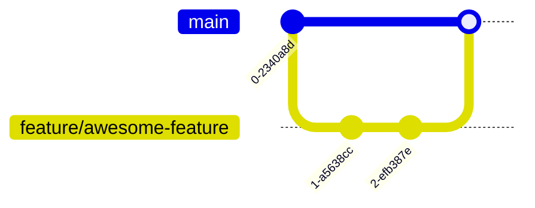
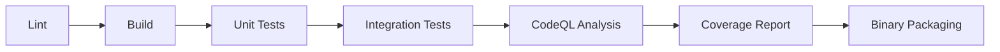

# Contributing to Txtmax

Thank you for your interest in contributing to **Txtmax**! This guide will help you effectively contribute to the project whether through code, documentation, testing, or feedback.

```toc
[[toc]]
```

## 📜 Code of Conduct

All contributors must adhere to our [Code of Conduct](CODE_OF_CONDUCT.md). Please read it before participating.

---

## 🚀 Quick Start Guide

### Prerequisites
- GCC 12+ or Clang 15+
- GNU Make 4.3+
- Bash shell
- Git 2.30+

```bash
# Verify installations
gcc --version
make --version
git --version
```

### Initial Setup
```bash
# Fork and clone
gh repo fork Calestial2/Txtmax --clone
cd Txtmax

# Build with debug symbols
make DEBUG=1

# Run basic verification
make test
```

---

## 🛠 Development Workflow

### Branch Strategy


### Code Structure
```
Txtmax/
├── src/            # Core source files
├── include/        # Header files
├── tests/          # Unit and integration tests
├── docs/           # Documentation
├── samples/        # Example files
└── Makefile        # Build configuration
```

### Advanced Build Options
```bash
# Build with optimizations
make OPTIMIZE=3

# Generate coverage report
make coverage

# Create release package
make dist

# Cross-compile for Windows
make CROSS_COMPILE=x86_64-w64-mingw32-
```

---

## 🔧 Contribution Guidelines

### Issue Management
```
| Ranking | Issue Type      | Label      | Response SLA |
| ------- | --------------- | ---------- | ------------ |
| 1       | Critical Bug    | P0         | 24 hours     |
| 2       | Feature Request | enhancement| 7 days       |
| 3       | Documentation   | docs       | 14 days      |
```

### Code Quality Standards
- Follow [C99 standard](https://en.cppreference.com/w/c/99)
- Adhere to Linux kernel coding style (modified)
- Maximum cyclomatic complexity: 15
- 100% test coverage for new features
- Doxygen comments for public APIs

```c
/* Example of required documentation */
/**
 * @brief Compresses text buffer using LZ77 algorithm
 * @param input Pointer to source buffer
 * @param size Input buffer size in bytes
 * @param output Pointer to destination buffer
 * @return int Compression ratio (0-100) or error code
 */
int compress_buffer(const char* input, size_t size, char* output);
```

### Testing Protocol
1. Unit tests: `make test-unit`
2. Integration tests: `make test-integration`
3. Fuzz testing: `make test-fuzz` (requires AFL++)
4. Performance benchmarks: `make benchmark`

---

## 📝 Pull Request Process

### PR Checklist
- [ ] Signed-off-by (DCO)
- [ ] Updated documentation
- [ ] Added/updated tests
- [ ] Passes CI pipeline
- [ ] No merge conflicts
- [ ] Descriptive title (fix|feat|chore|docs|refactor: ...)

### CI Pipeline Stages


### Review Process
1. Automated checks pass
2. Maintainer review (72 hours)
3. Security audit (for critical components)
4. Final approval and squash merge

---

## 💡 Advanced Topics

### Debugging Tips
```bash
# Use AddressSanitizer
make SANITIZE=address

# Generate flame graph
make profile

# Debug memory leaks
valgrind --leak-check=full ./txtmax sample.txt
```

### Performance Optimization
- Use `perf stat` for cycle analysis
- Leverage PGO (Profile Guided Optimization)
```bash
make PGO=generate
# Run benchmark workload
make PGO=use
```

---

## 📚 Documentation Standards

### Doc Structure
```markdown
docs/
├── API-REFERENCE.md
├── ARCHITECTURE.md
├── PERFORMANCE-GUIDE.md
└── SECURITY-POLICY.md
```

### Documentation Build
```bash
make docs  # Generates HTML/PDF documentation
```

---

## 🆘 Getting Help

```
| Channel         | Response Time | Best For                   |
|-----------------|---------------|----------------------------|
| GitHub Issues   | 48 hours      | Technical discussions      |
| Email           | 72 hours      | Security-related matters   |
```

---

## 🙌 Recognition Program

Top contributors will be:
- Featured in release notes
- Added to `HALL_OF_FAME.md`
- Eligible for maintainer status (after 3 major contributions)

---

```version
Current Version: 14.5.14 | Last Updated: 2025-2-20
```

```license
SPDX-License-Identifier: GPL-3.0-or-later
```

🚀 Happy Coding! Let's build something amazing together!
```
